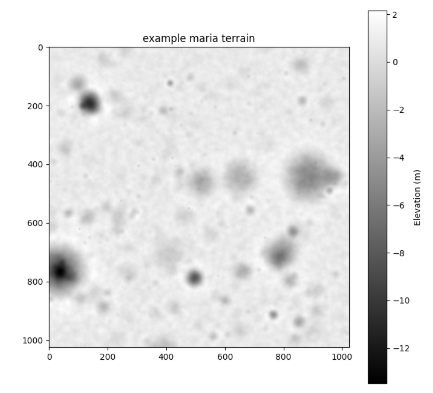
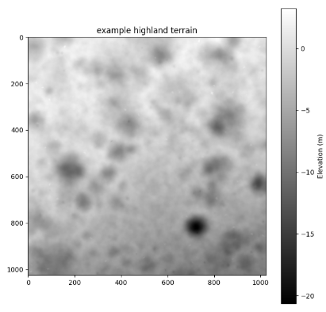

# Lunar Terrain Generator

A procedural lunar terrain heightmap generator for Python. The terrain generation is based on real lunar data and is set to generate terrain at a scale of **1 meter per pixel**.

Example usage is provided in `example.ipynb`.

## Developement Methodology

This generator was developed using real lunar topographic data at a **2 meter per pixel** scale obtained from the [LROC RDR Data Portal](https://wms.lroc.asu.edu/lroc/rdr_product_select).  
To ensure realism, the generated terrain was validated against real lunar topographic statistics.

## Example Outputs

Below are sample generated terrains representative of two key lunar landscapes:

**Mare Terrain (smooth, basaltic plains):**  


**Highland Terrain (rugged, cratered regions):**  


## Installation

```bash
pip install git+https://github.com/anderspearson206/LunarTerrainGenerator.git
